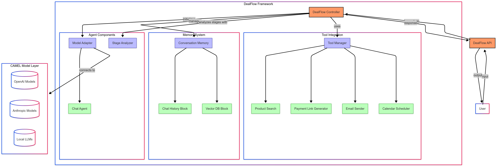
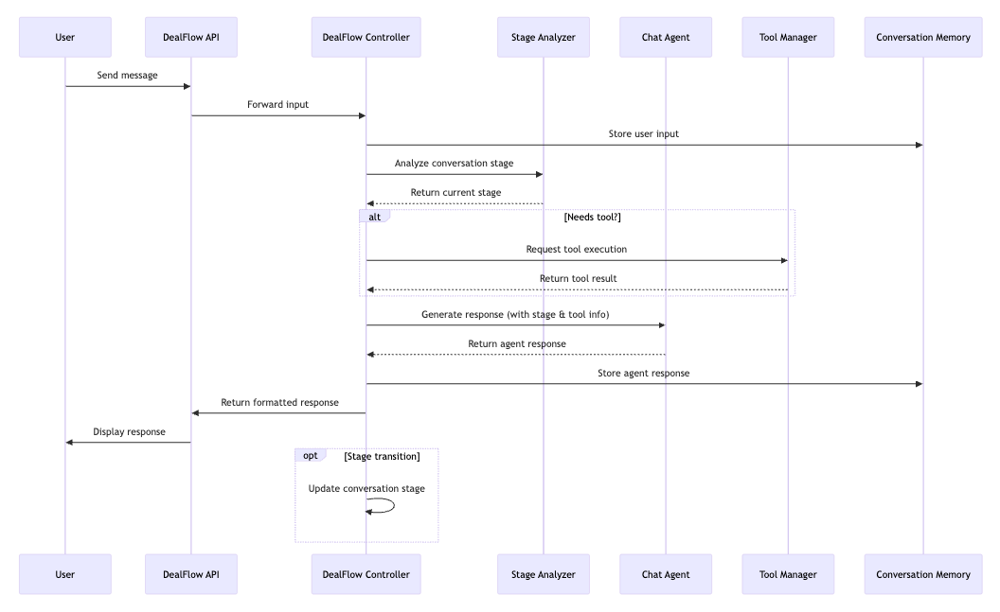

# DealFlow

[](https://bsstfs.visualstudio.com/DealFlow/_build/latest?definitionId=1&branchName=main)
[](https://bsstfs.pkgs.visualstudio.com/DealFlow/_packaging?_a=feed&feed=dealflow)

DealFlow is an advanced sales agent framework built on CAMEL (Communicative Agents for "Mind" Exploration of Large Language Model Society). It provides a robust system for creating autonomous, intelligent sales agents capable of conducting natural, contextually-aware sales conversations with potential customers.




## Overview

DealFlow aims to replicate and enhance the capabilities of SalesGPT while leveraging the powerful agent communication framework provided by CAMEL. The system enables sales agents to:

- Conduct natural, contextually aware sales conversations
- Analyze and adapt to different stages of the sales process
- Utilize tools for product searches, payment processing, scheduling, and more
- Maintain conversation history and learn from previous interactions
- Generate effective responses tailored to customer needs

## Architecture



DealFlow is built using the following components from the CAMEL framework:

1. **Core Agent System**
   - Uses CAMEL's ChatAgent for the primary sales agent
   - Leverages RolePlaying for more complex multi-agent scenarios

2. **Conversation Management**
   - Implements LongtermAgentMemory for maintaining conversation context
   - Stores and retrieves relevant conversation history

3. **Sales Stage Management**
   - Custom stage analyzer for determining the current sales conversation stage
   - Stage-appropriate response generation

4. **Tools Integration**
   - Product knowledge base search
   - Payment processing
   - Calendar/meeting scheduling
   - Email communication

5. **Configuration System**
   - Customizable company information
   - Adaptable salesperson profile and style
   - Adjustable conversation goals and strategies

## Key Components

### `DealFlow` Class

The main controller class that manages the sales agent's behavior, conversation flow, and tool usage.

### `SalesStageAnalyzer`

A specialized component for determining the current stage of the sales conversation and suggesting appropriate strategies.

### `ToolManager`

Manages the integration and execution of various tools that enhance the agent's capabilities.

### `DealFlowAPI`

External API for integrating DealFlow into applications, websites, or other systems.

## Usage Example

```python
from dealflow import DealFlow
from camel.models import ModelFactory
from camel.types import ModelPlatformType, ModelType

# Initialize a language model
model = ModelFactory.create(
    model_platform=ModelPlatformType.OPENAI,
    model_type=ModelType.GPT_4O_MINI,
)

# Configure the sales agent
sales_agent = DealFlow(
    model=model,
    salesperson_name="Alex Johnson",
    salesperson_role="Solutions Consultant",
    company_name="TechSolutions Inc.",
    company_business="We provide enterprise-grade cloud computing solutions for businesses of all sizes.",
    company_values="We believe in empowering businesses through technology that's accessible, reliable, and forward-thinking.",
    conversation_purpose="understand the client's cloud infrastructure needs and present our scalable solutions",
    use_tools=True
)

# Start the conversation
sales_agent.seed_agent()

# Human input handling
human_input = "Hi, I got your email about cloud solutions. Can you tell me more?"
response = sales_agent.step(human_input)
print(response)
```

## Comparison with SalesGPT

While inspired by SalesGPT, DealFlow offers several advantages through the CAMEL framework:

1. **Advanced Agent Communication**: CAMEL's specialized communication protocols enable more natural and effective interactions.

2. **Enhanced Memory Systems**: More sophisticated memory management for improved context retention.

3. **Flexible Tool Integration**: Streamlined approach to integrating external tools and APIs.

4. **Scalable Multi-Agent Support**: Better support for multi-agent scenarios where multiple sales representatives or specialists might be involved in the sales process.

5. **Improved Reasoning Capabilities**: CAMEL's focus on agent reasoning leads to more strategic sales conversations.

## Installation

```bash
pip install dealflow
```

## Requirements

- Python 3.9+
- camel-ai
- Required API keys (depending on the model and tools used)

## License

[MIT License](LICENSE)
